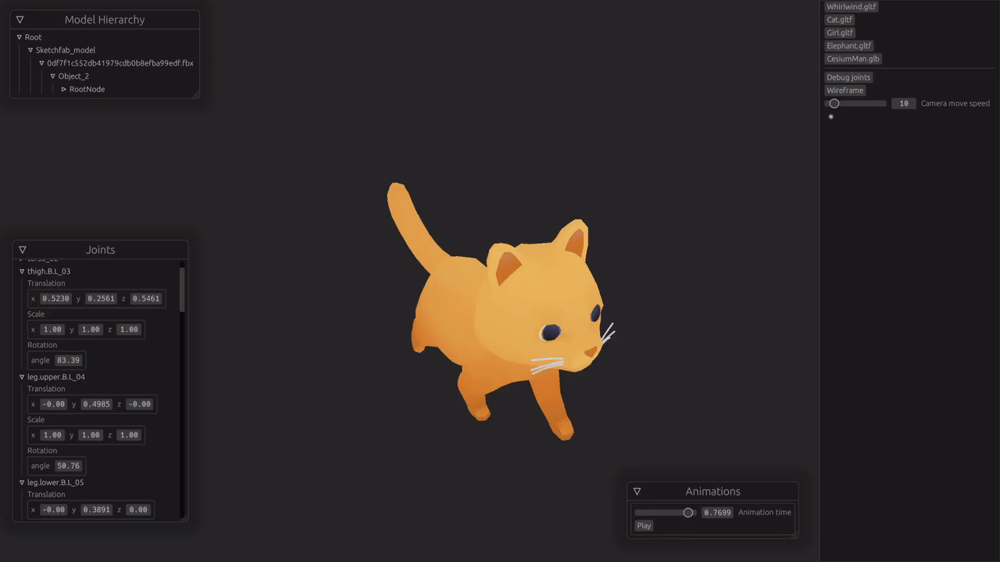

# Leoric
Skeletal animation project for my Computer Graphics course.

# Showcase

This work is based on "Toon Cat FREE" (https://sketchfab.com/3d-models/toon-cat-free-b2bd1ee7858444bda366110a2d960386) by Omabuarts Studio (https://sketchfab.com/omabuarts) licensed under CC-BY-4.0 (http://creativecommons.org/licenses/by/4.0/)